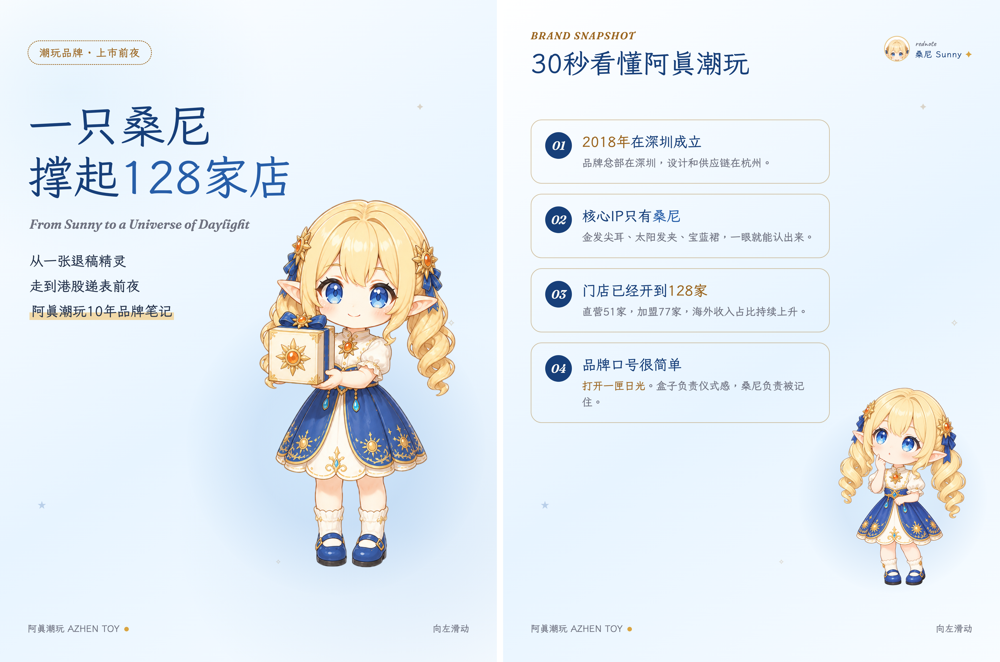
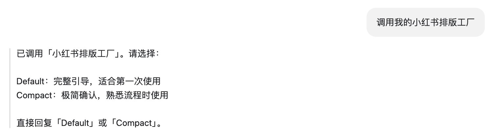
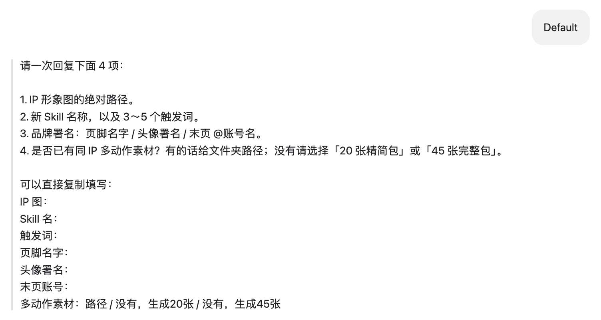
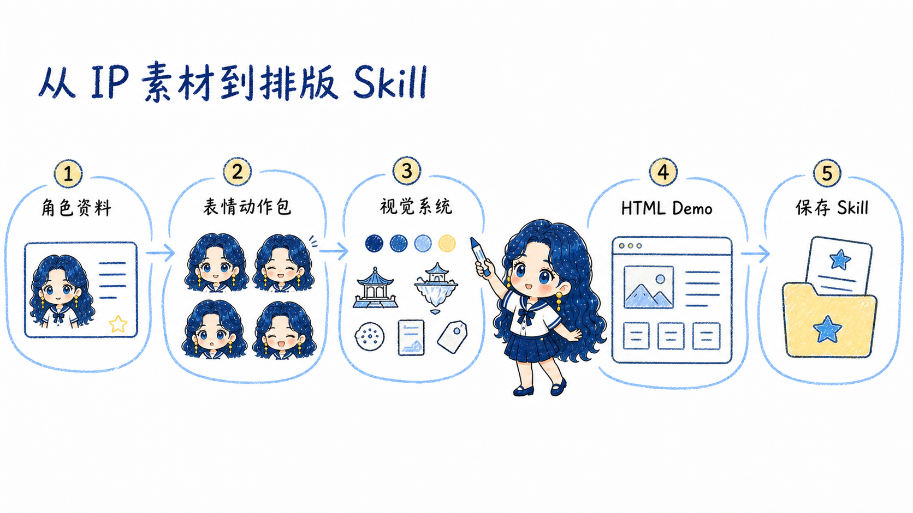
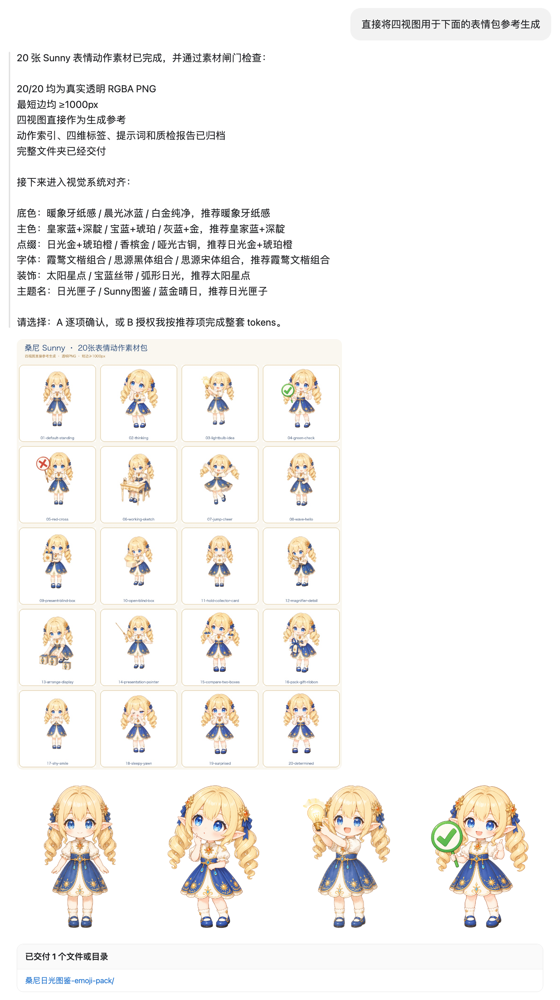
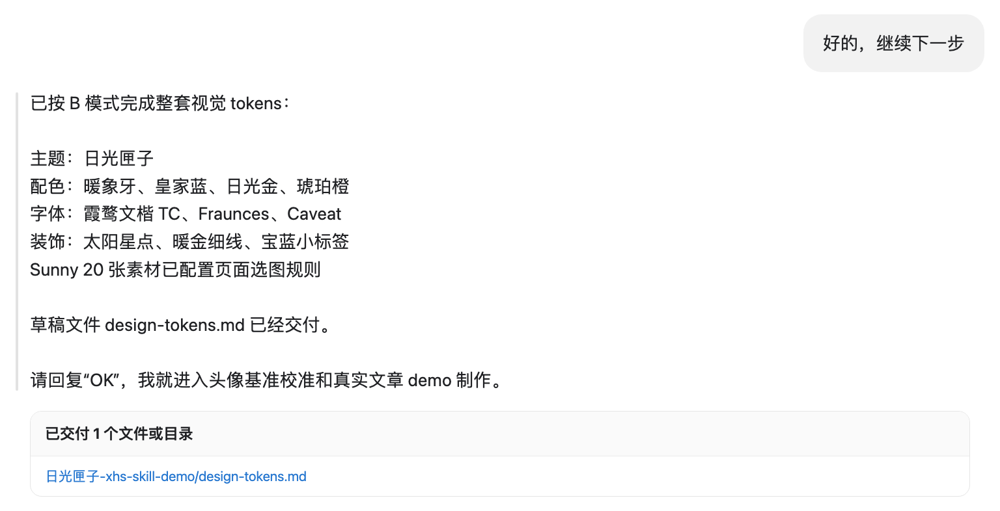
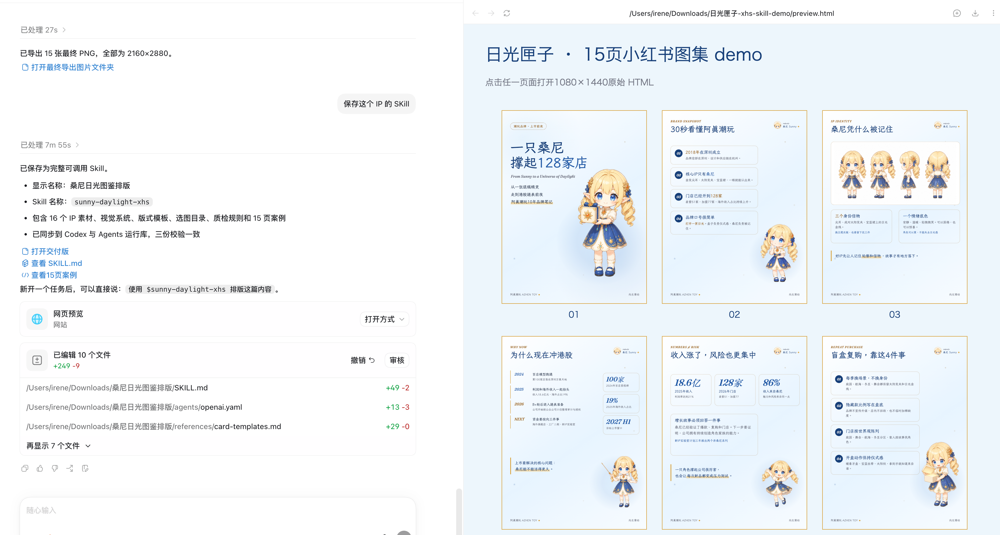
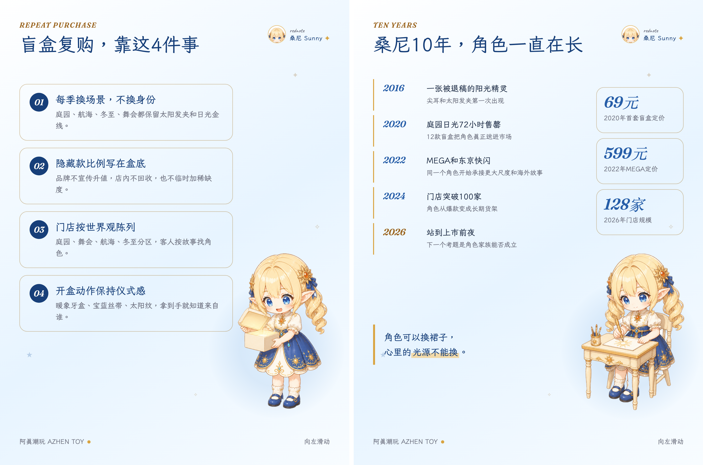

# 小红书排版工厂 Skill

这个仓库提供的是一套“小红书排版母 Skill”。它用来把你的 IP 素材、品牌资料和内容偏好，制作成一个可长期复用的专属小红书排版 Skill。第一次运行时，它会带你完成动作素材、视觉系统、HTML 母模板、真实文章 Demo 和逐页质检。

专属 Skill 完成并安装后，以后只需提供新文章或资料文件，就能继续沿用同一个角色、配色、字体和版式体系，生成整套小红书 3:4 网页预览与 2160×2880 PNG。

<p align="center">
  
</p>

*图中是潮玩 IP 桑尼的实际输出。专属 Skill 安装后，可以直接读取新文章，生成网页总览与 2160×2880 正式图片。*

## 适合谁

- 已有个人 IP、品牌吉祥物或角色形象，想稳定产出系列图文
- 希望中文文字准确、版式统一、局部修改方便
- 想把一次调好的模板保存成专属 Skill，后续反复调用
- 需要网页预览、联系表总览和 2160×2880 PNG 交付

## 安装

Codex：

```bash
git clone https://github.com/irenerachel/xiaohongshu-layout-factory-skill.git ~/.codex/skills/xiaohongshu-layout-factory
```

Agents：

```bash
git clone https://github.com/irenerachel/xiaohongshu-layout-factory-skill.git ~/.agents/skills/xiaohongshu-layout-factory
```

Claude Code：

```bash
git clone https://github.com/irenerachel/xiaohongshu-layout-factory-skill.git ~/.claude/skills/xiaohongshu-layout-factory
```

安装后新建一次对话，让智能体重新加载 Skills。

## 第一次调用

直接说：

```text
调用小红书排版工厂，帮我做一套基于自己 IP 的小红书排版 Skill。
```

Skill 会先让你选择模式：

| 模式 | 适用情况 | 特点 |
|---|---|---|
| Default | 第一次使用，推荐 | 完整引导，每个关键决策都会解释 |
| Compact | 已经熟悉流程 | 只确认决策点和默认选项 |

第一次建议选择 `Default`。前期信息越完整，后面的素材、排版和专属 Skill 越稳定。

<p align="center">
  
</p>

## 提前准备

| 内容 | 说明 |
|---|---|
| IP 形象图 | 优先提供完整四视图或全身图，PNG、JPG 均可 |
| Skill 名称与触发词 | 例如“潮玩品牌排版Skill”“调用我的潮玩排版” |
| 品牌署名 | 页脚名字、右上角头像署名、末页账号 |
| IP 或品牌资料 | 人设、行业、内容方向、品牌案例、视觉偏好 |
| 动作素材 | 有现成表情包就给文件夹；没有可生成 20 张精简包或 45 张完整包 |
| 测试文章 | 用一篇真实文章跑第一版 Demo |

<p align="center">
  
</p>

## 流程总览

<p align="center">
  
</p>

角色资料、表情动作包、视觉系统与 HTML Demo 会逐步沉淀进最终的专属 Skill。

## 完整制作流程

1. 选择 `Default` 或 `Compact` 模式。
2. 提供 IP 图片、Skill 名称、触发词、品牌署名和内容方向。
3. 确认透明底、白底或指定底色；需要时完成抠图。
4. 整理已有动作素材，或生成 20 张精简包、45 张完整包；逐张检查动作、手指、道具、服装、五官和角色一致性。
5. 输入“确认素材”，再确定底色、主色、点缀色、字体、装饰语言和主题名称。
6. 校准正文页右上角头像，使用一篇真实文章生成首个 5 至 15 页 Demo。
7. 检查网页总览，继续调整版式、留白、颜色、人物位置、流程线、卡片边距和页面密度。
8. 保存专属排版 Skill，安装到运行库，并用新文章测试；确认网页总览后导出 2160×2880 PNG。

素材全部确认后再进入正式排版。动作包、人物比例和页面留白会共同影响模板结构，前面校准得越细，后续复用越省时间。

### 动作素材包

<p align="center">
  
</p>

### 视觉系统选择

<p align="center">
  
</p>

## 可直接复制的完整调用示例

```text
调用小红书排版工厂，使用 Default 模式。

IP 形象图：/绝对路径/我的IP四视图.png
新 Skill 名称：我的品牌小红书排版
触发词：我的品牌排版、品牌小红书图集、调用我的排版Skill
页脚名字：我的品牌
右上角署名：主理人小真
末页账号：@我的品牌
品牌资料：/绝对路径/品牌介绍.md
动作素材：目前没有，请生成 20 张精简包
测试文章：/绝对路径/第一篇文章.md

请先完成素材检查，再反推视觉系统；Demo 出来后给我网页总览，确认后再保存专属 Skill 和导出 2K PNG。
```

## 以后如何复用

专属 Skill 保存并安装后，在新对话中直接说：

```text
调用“我的品牌小红书排版”，读取这篇文章并生成完整图集：/绝对路径/文章.md
先给我网页总览和联系表，逐页检查完成后再导出 2K PNG。
```

也可以提供飞书云文档链接。当前环境已连接飞书 CLI 时，Skill 可以读取正文，并按要求提取文档中的图片参与排版。

## 最终交付

完成后通常包含：

1. 专属 Skill 完整目录
2. `SKILL.md` 与视觉、语气、版式、质检规则
3. 多页案例网页与真实 Demo
4. 网页总览和联系表
5. 2160×2880 PNG；可选 3 倍超清 PNG、PDF 合集和 zip 包

<p align="center">
  
</p>

## HTML 排版适用情况

HTML 适合中文准确、系列统一、批量复用和局部精修。人物素材、字体、颜色、卡片、边距与版式会先固定，后续换文章时继续沿用。

氛围强、插画感强、每页画面差异很大的项目，也可以采用混合方案：封面使用图像模型，正文和信息卡交给 HTML 模板。

## 仓库内容

- [SKILL.md](SKILL.md)：触发条件与完整工作流
- [八步工作流](references/workflow.md)：每一步的执行细节
- [素材包规则](references/asset-pack.md)：20 张与 45 张动作包规划
- [页面骨架](references/card-templates.md)：封面、内容、案例、收尾模板
- [通用硬规则](references/universal-rules.md)：画布、字体、留白、零投影与逐页质检
- [避坑指南](references/pitfalls.md)：真实项目中的常见返工点
- [种子模板](assets/template.html)：1080×1440 HTML 母模板
- [抠图脚本](assets/cutout.swift)：macOS 14+ Vision 抠图
- [README 插图](docs/images)：来自飞书图文教程的流程与成品示例

## 环境说明

- HTML 画布为 1080×1440，默认按 2 倍渲染为 2160×2880
- `cutout.swift` 需要 macOS 14+；其他系统可使用常用抠图工具
- 网页导出需要 Chrome 或兼容 Chromium 浏览器
- 字体默认按国内镜像、备用镜像、Google Fonts 的顺序加载，也可改用本地字体

## 致谢

版式与工程化思路受到大善人歸藏的 `guizang-ppt-skill` 启发，感谢开源分享。

## License

MIT

## 输出效果

下面是专属 Skill 导出的潮玩方向正式成品图。

<p align="center">
  
</p>
